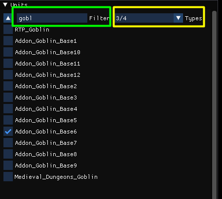
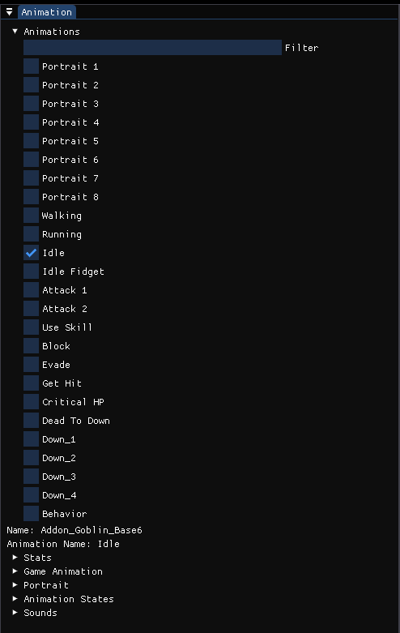
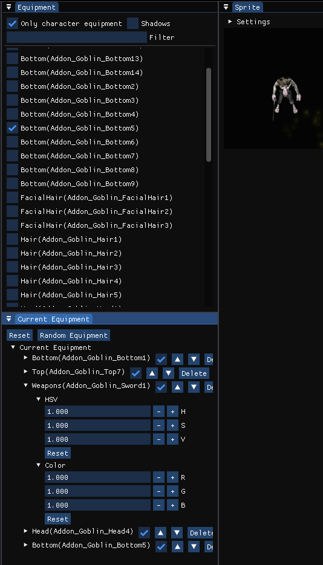

# Character Editor

This is a Character Editor created which currently supports characters from [PV Games](https://www.patreon.com/PVGames/posts) and [Laserwolve Games](https://www.laserwolvegames.com/home)

You can view animations, configure custom equipment, configure custom colors and other things.
You can save/load the character configurations using json files so you can easily manage multiple characters.
Also you can export characters with various options to sprite sheets or export sprite frames.

It will automatically add all the characters found in folders you add via main menu (`File->Add Image Folder`). It is recommended to just add the root folders, the tool will then automatically find all the characters included.

***Important : The folder structure per character shouldn't be changed to avoid that the tool can't identify the details about it***

By default you start with a default unit, you can edit is as you like and then save it as a .json file. Each character will be displayed in a separate tab.

## Units Menu

In this menu you can see all the units the tool has found.
With the filter(Marked in `green` you can search for specific units.

In the Types combo box you can filter all units by their types.

## Animation Menu

In this menu you can see all animations of the selected unit and select the one you want to view/edit.

### Stats
Here you can see stats about the selected animation like the texture size etc.

### Game Animation
Here you can create a game animation for the selected animation. Game animations can be configured with custom events, custom playback speed etc. if you use Rpg Tools as your game engine.

This is the tutorial for [game animations](GameAnimations.md)

### Portrait
Here you can configure how the character portraits should be displayed

### Animation States
Here you can configure animation states for your game (if you use Rpg Tools as the game engine). With animation states you can define a set of animations for a state, for example the animations played when the character is Idle.

### Sounds
Lets you define special sounds like hit sounds for your character.

## Equipment Menu

### Equipment
Here you can see a list of all equipment parts compatible with the current character. You can equip items by clicking on them.

### Current Equipment
Here you can see the list of currently equipped items, change the order(using the arrow buttons) and change their properties(e.g. color or HSV)

## Sprite Menu+
Here you can see a live preview of the current sprite with all equipment parts and evens configured in game animations(e.g. VFX / SFX)
In the settings menu you can change the scale and the background color.
You can also toggle looping of the animation, pause it and see the current frame index(Which can be changed manually while paused).