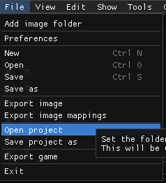
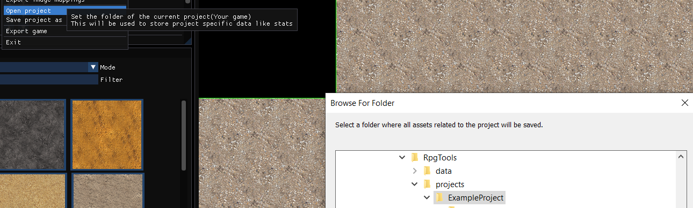
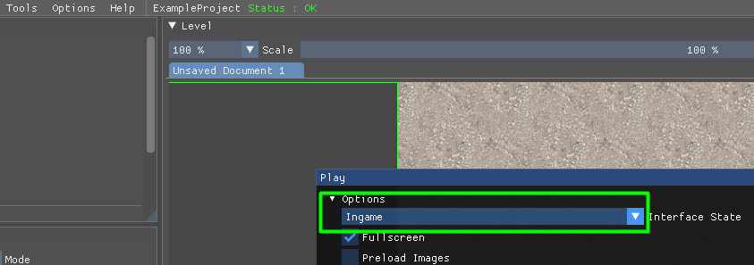
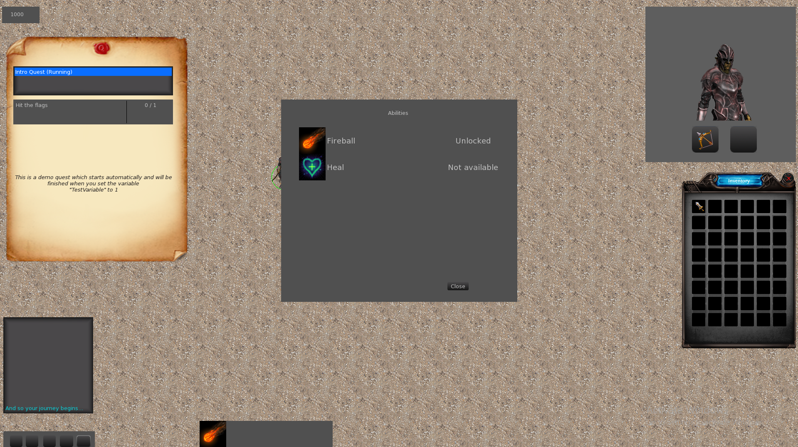

# Example Project

I created an example project everyone can use to get started or to see how to configure specific data.

## Setup

To load the example project you need to click on File->Open Project in the main menu:

Then you need to select the directory "projects/ExampleProject" which should be selected by default:

project")

Afterwards you should be able to launch any level you create. When you select the Interface Stat "Ingame" you should see the default UI

If everything worked it should look similar to that:
