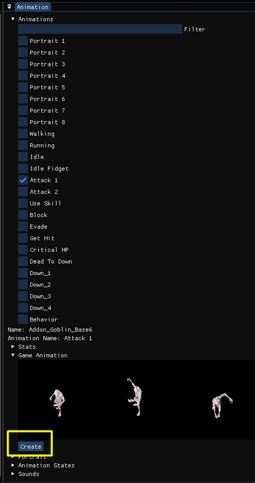
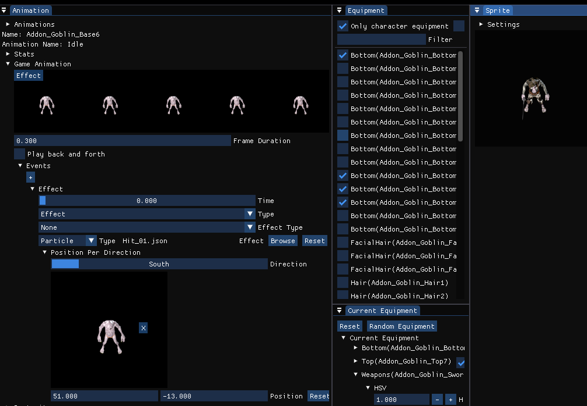

# Game animations

## Overview
Game animations can be configured with custom events, custom playback speed etc. if you use Rpg Tools as your game engine.

### Create a new game animation
When you select a character and an animation you can create a game animation for the selected animation by clicking on the `Create` button.

### Edit events
You can add new events by clicking on the `+` button of the `Events` property.

For each event you can edit its properties.

| Property | Description |
| -------------                     |:-------------:          |
| Event Type | Here you can configure which kind of event it is, the types are described below |
| Time | The time when this event is triggered. You can drag the button horizontally to change it |

### Event types

#### Effect

| Property | Description |
| -------------                     |:-------------:          |
| Effect Type | Use none if you want to configure a custom effect or choose a special type like `Weapon Attack` to trigger the attack effect of the current weapon |
| Effect | Here you can select which kind of effect should be triggered |

#### Sound
Plays a specific sound when the event is triggered

#### Attack
Trigger an attack. This checks if the attack hits a target. Only useful when you configured this animation for an attack ability.

#### Cast
Trigger casting of the currently selected spell. Only useful when you configured this animation for an ability