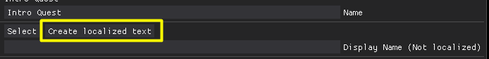
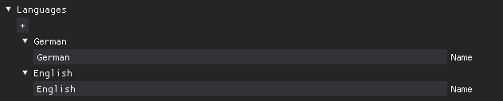
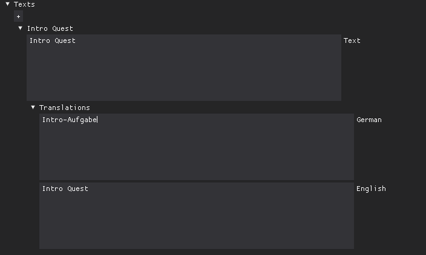

# Localization

## Overview
Rpg Tools includes tools to localize your texts for different languages. By default texts are not localized. If you only want to support a single language you don't need to care about localization at all, then you can just enter all texts directly.

### Create localized text
When you edit a text that can be displayed in the game, e.g. a quest text, you can create a localized text which will add a new entry with a GUID(a unique ID) to the list of localized texts.

### Edit languages
You can add any languages to the list in the menu which you can open in the Data Editor via `View->Localization`

### Edit texts
In the same menu (`View->Localization` in the Data Editor) you can edit all texts. The top text(Displayed as "Text") is the developer text, the texts below are localized texts for all languages:
