# Level Editor

This is a Level Editor created for any PNG graphics. It contains a couple of features for assets from [PV Games](https://www.patreon.com/PVGames/posts)

It lets you create levels like these:
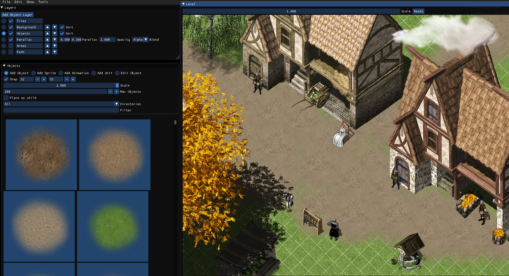

Here you can find the documentation:

## Main Menu
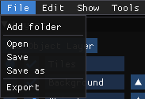

Via main menu you have access to some global commands.

### Add folder
  
When you launch the Level Editor for the first time the "Add folder" dialog will automatically open. You should then navigate to a directory which contains PV Games assets and then click OK(Make sure you navigate inside directory in the dialog). The Level Editor will automatically parse all images inside this folder and all sub folders.
If you want to add multiple folders you can later on navigate to "File->Add Folder" to add more folders.

### Open/Save files
#### Save files
To save your level navigate to File -> Save as, navigate to the directory where you want to save it and enter a filename(You don't need to add the .json extension, it will be added automatically)
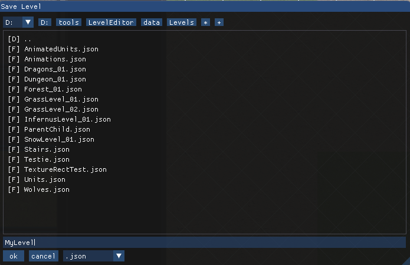  
Afterwards you can just save via File -> Save

#### Open files
To open levels navigate to File->Open, select the .json file of the level you want to load and click OK.

### Undo/Redo
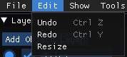
- You can undo changes via "Edit->Undo" or Ctrl/Z
- You can undo changes via "Edit->Redo" or Ctrl/Y
- You can resize your level using "Edit->Resize"

## Layers
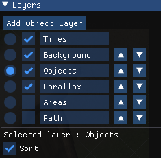
- With the radio button you can select the current layer
- With the checkbox you can toggle the visibility of each layer
- In the textbox you can view and edit the name of each layer
- With the up/down arrows you can reorder layers. The first layer will be drawn at first(Background layer)

There are different types of layers:

### Tiles Layer
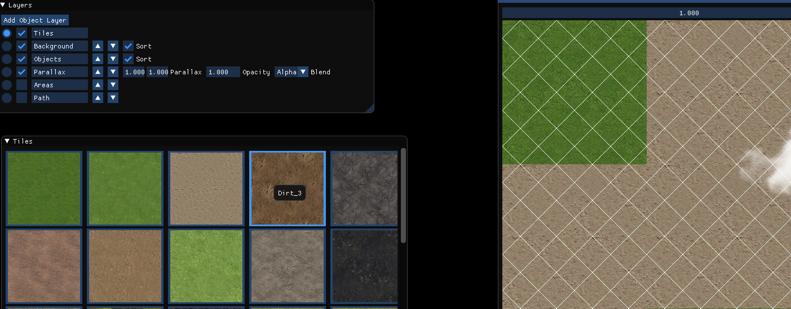

All images that end with the suffix "_Tile.png" are treated as tiles(This is the suffix tiles from PVGames use)

Modes

#### Place tile
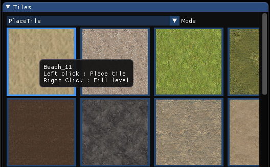
- You can see a list of all tiles and select the tile you want to place
- You can place a tile via left click
- You can fill the level with the selected tile via right click

#### Change height
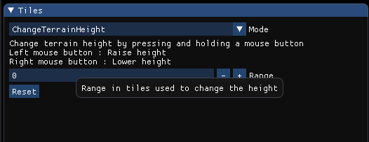
- You configure the range for which the height will be changed
- You can raise the terrain height by holding the left mouse above a tile
- You can lower the terrain height by holding the right mouse above a tile

### Object Layer
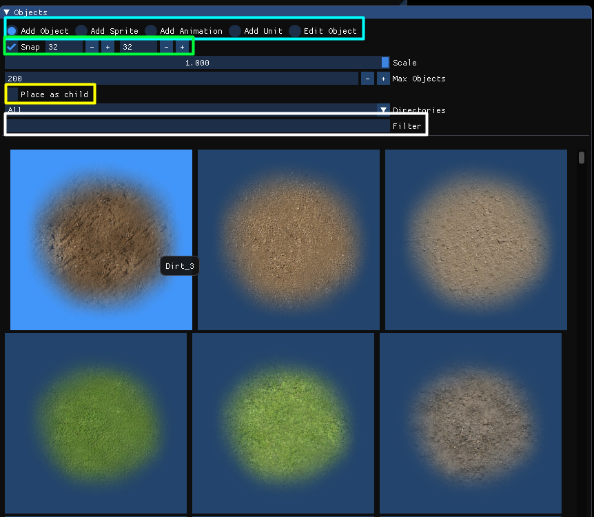
- In the first row you can select the mode(Will be explained below)
- Snapping automatically sets the coordinate of the objects you place to a multiple of this value. e.g. 32/32 automatically sets X/Y to 32/64/96 etc. This is very useful for most of the sprites since they need to be aligned to fit to the other ones. You can disable snapping by unchecking the checkbox and you can edit the snap size(Most of the time 16 or 32 are useful here)
- Place as child automatically adds the object you place as a child of the object under the cursor. A child will be rendererd in the same order as its parent which is very useful for all cases where an image should belong to its parent, e.g. a book on top of a bed or a flag on top of a wall.
- You can use the Filter box to search for any sprites
- With the value "Max Objects" you define how many images will be displayed at max in the placement menu. This is mostly to avoid to load too many images at once. Most of the times the default value should be fine
- You can change the scale of the preview images to display more images at the same time
- You can filter the directories to only display images of some directories

#### Object Modes

##### Add Object
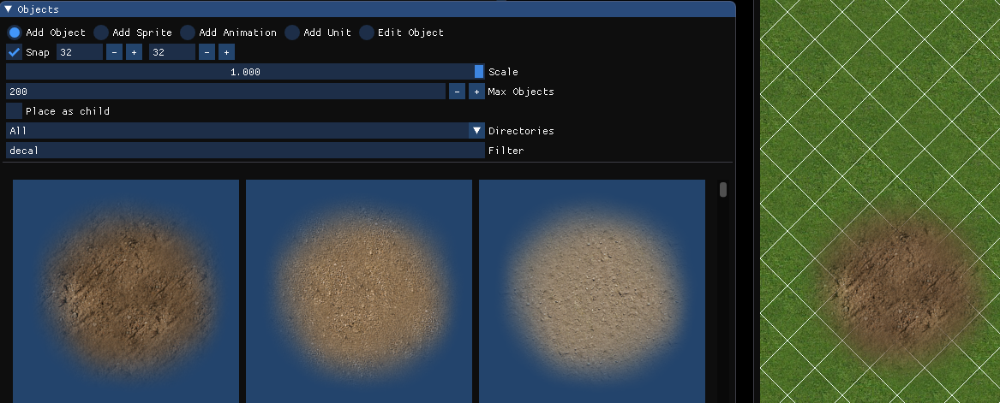
This is the mode that lets you place single images without additional options.

##### Add Sprite
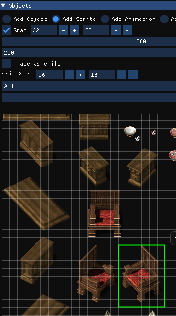  
This mode is similar to "Add Object" but it lets you select a rectangle from a sprite sheet to add objects

##### Add Animation
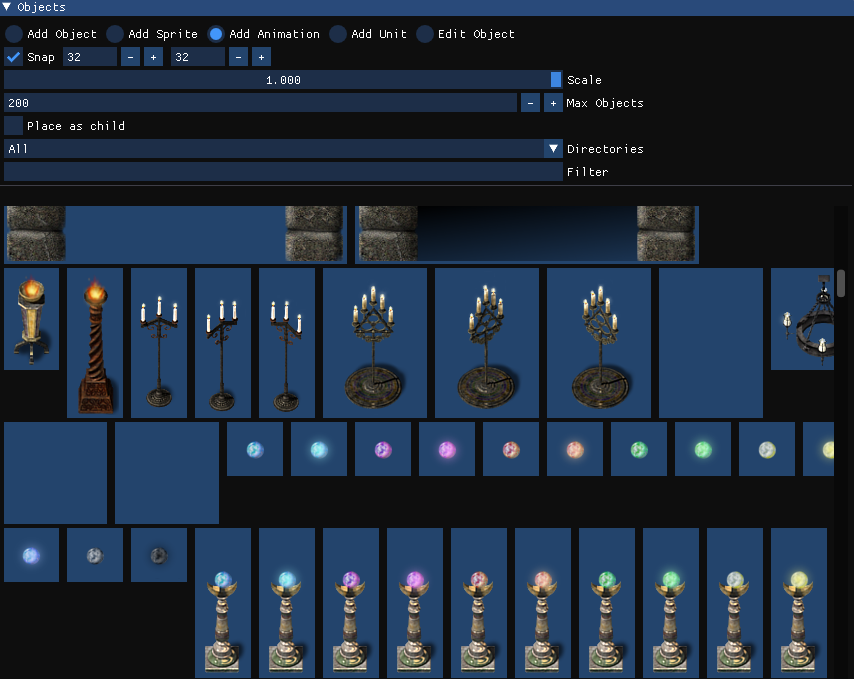
This mode lets you set predefined animations to the level.

##### Add Unit
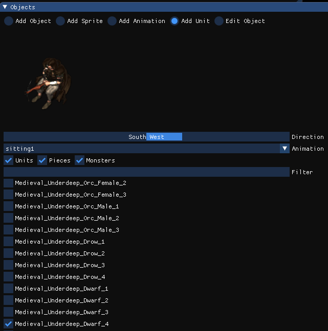  
This mode lets you place any unit found in the direcories you added. You can select the animation and the direction and view a live preview.

##### Add Particle Emitter
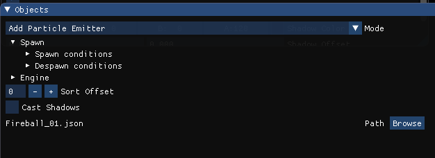  
This mode lets you place an emitter for any particle you created in the Particle Editor which is saved in the directory of the current project.

##### Edit Object
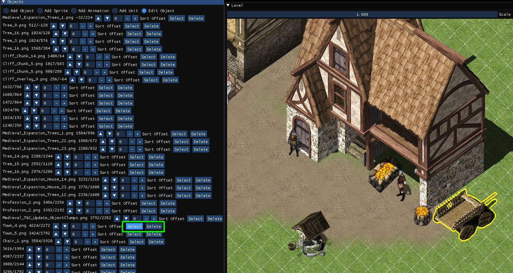 
Here you can see a list of all objects, select and delete them. In this mode you can also select any object via left click and move objects by dragging them.
Selected objects are highlighted in yellow as in this image: 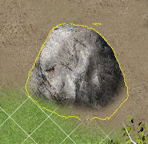  
You can deselect an object by pressing Escape or by clicking on an empty slot.

### Parallax Layer
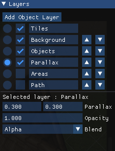  
A parallax layer works exactly as an object layer but it adds the parallax scroling feature. You can edit these values:
- ScaleX : This is the factor used to scale x values. Values smaller 1 mean it scrolls slower, greater 1 scrolls faster as usual
- ScaleY : This is the factor used to scale y values. Values smaller 1 mean it scrolls slower, greater 1 scrolls faster as usual
- Opacity defines the alpha value of the layer
- Blend mode defines how the layer is drawn

### Area Layer
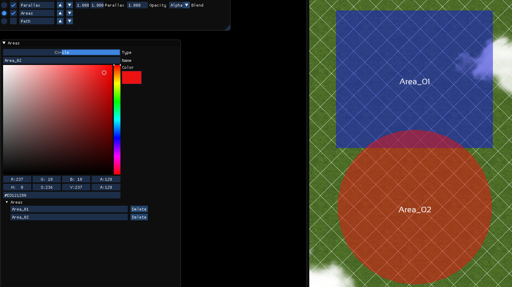
- You can create rectangular and circular areas with a name and a color
- You can rename or delete existing areas in the view at the bottom

### Path Layer
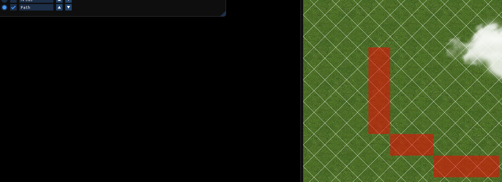
- You can add path blockers via left click
- You can remove path blockers via right click

### Sound Layer
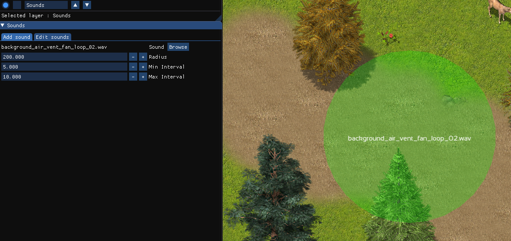

In the Sound Layer you can edit sound emitter which will play sounds when a player moves next to them.

- You can add sound emitters via left click
- You can change the radius
- You can configure the min- and max interval (in seconds) when this emitter should check if it should be started
