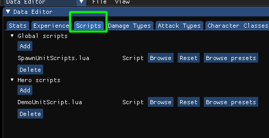
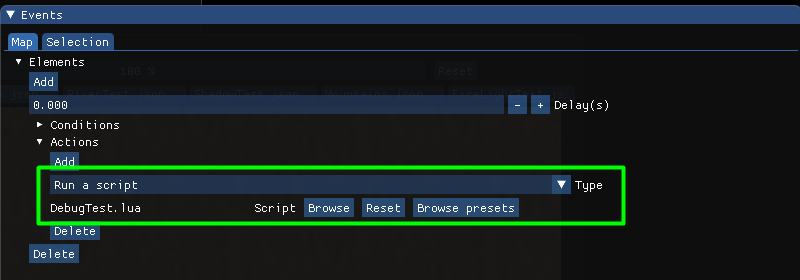
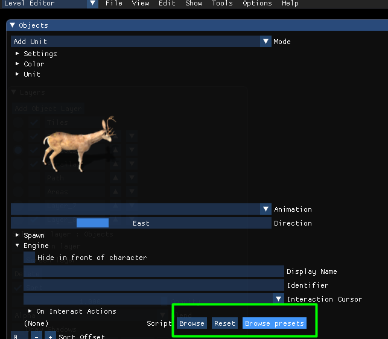

- [Lua scripting](#lua-scripting)
  - [Overview](#overview)
  - [Global scripts](#global-scripts)
  - [Engine scripts](#engine-scripts)
  - [Level scripts](#level-scripts)
  - [Unit scripts](#unit-scripts)
  - [Object scripts](#object-scripts)
  - [Debugging](#debugging)
  - [Global functions](#global-functions)
    - [getCurrentDeltaTime](#getcurrentdeltatime)
    - [sleep](#sleep)
    - [stopScript](#stopscript)
    - [setVariable](#setvariable)
    - [getVariable](#getvariable)
    - [getStringVariable](#getstringvariable)
    - [addUnit](#addunit)
    - [addCharacter](#addcharacter)
    - [playMusic](#playmusic)
    - [playSound](#playsound)
    - [logMessage](#logmessage)
    - [loadLevel](#loadlevel)
    - [addLight](#addlight)
    - [setLightPosition](#setlightposition)
    - [setLightAlpha](#setlightalpha)
    - [setLightZ](#setlightz)
  - [Global variables](#global-variables)
    - [map](#map)
  - [itemManager](#itemmanager)
  - [statManager](#statmanager)
  - [abilityManager](#abilitymanager)
  - [API](#api)


# Lua scripting

## Overview
Rpg Tools uses Lua for scripting. You can check [this guide](https://www.tutorialspoint.com/lua/lua_overview.htm) to get started.
[This cheat sheet](http://lua-users.org/files/wiki_insecure/users/thomasl/luarefv51.pdf) is also very helpful.

Every script can have two methods:
- init() is called once, here you can initialize your script if needed
- update() is called every frame.

Example:

```lua
function init()
    x = 100
end

function update()
    x = x + 1
    print('x = ' ..x)
end
```

## Global scripts
You can configure global scripts in the Data Editor.



These scripts will run no matter which level you start and should be used for custom game rules.
There are global scripts and hero scripts. Hero scripts will run for each hero and work like other unit scripts.

## Engine scripts
You can configure engine scripts in the Data Editor.

These scripts will run when you start the RpgTools executable and can be used for custom tools.

## Level scripts
You can configure which scripts should run for your level in the events window. There you can define conditions(by default none) and then choose "Run script" as the action and choose one of the scripts(Either "Browse" for your custom scripts or "Browse presets" for builtin scripts)



In a level script you an access all global variables(see below)

## Unit scripts
When you run a script for a specific unit you can access this unit using the variable **unit**

Example:

```lua
unit:startAnimation("Rest", animationMode.Loop, 1000)
unit.direction = 1
```

## Object scripts
When you run a script for a specific object you can access this object using the variable **object**

You can configure object scripts here:
  

Example:

```lua
object.opacity = 0.5
```

## Debugging
You can use Visual Studio Code to debug lua scripts. For that you need to do the following:
- Right click on the folder data/scripts of the RpgTools and choose "Open with Code"
- Choose "File->Add folder to workspace" and navigate to the data/scripts folder of your project folder(By default it is the folder projects/DefaultProject/data/scripts)

You need to install the extension "Lua Helper"

To start debugging go to "Run->Start Debugging" or press F5. You can place breakpoints, step through all scripts etc.

## Global functions

### getCurrentDeltaTime
Returns the current delta time in seconds. This can be useful for things like movement that should depend on the time that has passed since the last frame.

Example:

```lua
-- move object with speed 50 pixels per second
speed = 50
deltaTime = getCurrentDeltaTime()
object.x = object.x + speed * deltaTime
```
### sleep
Let the current script sleep for a defined duration in milliseconds.
Afterwards the script will continue directly after the sleep call.

Example:

```lua
unit:startAnimation("idle1", animationMode.Loop, 1000)
-- wait 2000 ms(2 seconds) after the next animation will be started
sleep(2000)
unit:startAnimation("idle2", animationMode.Loop, 1000)
```

### stopScript
A script will call its update method every frame. If you want to stop the script completely you need to call stopScript once to kill the script.

Example:

```lua
if not unit.isAlive then
    -- stop the script when the unit is dead
    stopScript()
end
```

### setVariable
Set a global variable. Can be used with strings and numbers

Example:

```lua
-- set the global variable 'Reward' to 10
setVariable('Reward', 10)

-- set the global variable 'CharacterName' to 'Frodo'
setVariable('CharacterName', 'Frodo')

```

### getVariable
Get a global number variable

Example:

```lua
-- store current value of 'Reward' variable
value = getVariable("Reward")
-- set the Reward variable to the current value + 1
setVariable("Reward", value + 1)
```

### getStringVariable
Get a global string variable

Example:

```lua
-- store current value of 'CharacterName' variable
name = getStringVariable("CharacterName")
-- print it to the console window
print('Character name is' ..name)
```

### addUnit
Adds a new unit to the current level

Example:

```lua
-- Create a buck at position 100/200
unit = addUnit('Buck', 100, 200)
```

### addCharacter
Adds a new character to the current level

Example:

```lua
-- Create an Orc(needs to be saved in your projects characters folder) at position 100/200 and set its team to Enemy
unit = addCharacter('SmallOrc_01', 100, 200)
unit.team = UnitTeam.Enemy
```

### playMusic
changes the background music using a path relative to the project audio folder ([ProjectFolder]/data/audio)

```lua
-- play music not looped
playMusic("BRPG_Take_Courage_FULL_Loop.wav", false)

-- play music looped
playMusic("BRPG_Take_Courage_FULL_Loop.wav", true)
```

### playSound
Play a sound using a path relative to the project audio folder ([ProjectFolder]/data/audio)

```lua
playSound("Noise_01.wav")
```

### logMessage
Log a message that can be displayed in the ingame log window

```lua
logMessage("You see a gigantic orc in front of you")
```

### loadLevel
Load a new level and optionally set the area where the hero should be spawned 

```lua
loadLevel("Level_01.json", "StartArea")
```

### addLight
Create a new light and returns a unique light ID.

### setLightPosition
sets the position of a light

### setLightAlpha
sets the alpha value of a light

### setLightZ
sets the z value of a light

Example:

```lua
lightID = addLight()
setLightPosition(lightID, 100, 200)
setLightAlpha(lightID, 0.5)
setLightZ(lightID, 0.1)
```


## Global variables

### map
Using the map variable you can access/change values of the current map.

## itemManager
returns the global item manager. You can use this to search for any items etc.

## statManager
returns the global stat manager. You can use this to search for any stat.

## abilityManager
returns the global abilityManager.

## API
This is the full [API](ScriptingAPI.md)