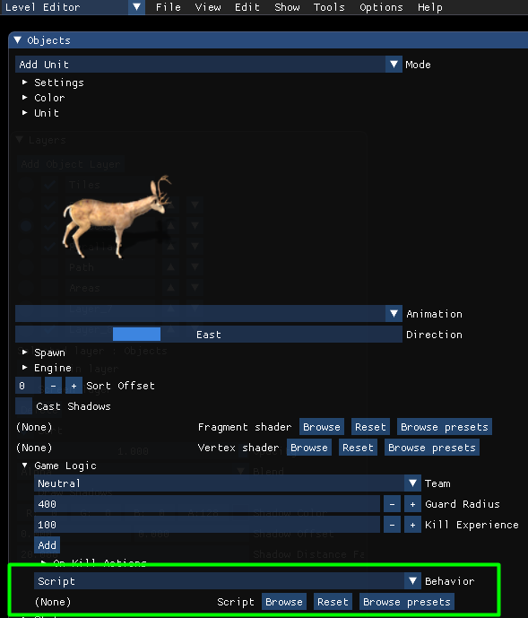

- [Lua scripting](#lua-scripting)
  - [Overview](#overview)
  - [Global scripts](#global-scripts)
  - [Engine scripts](#engine-scripts)
  - [Level scripts](#level-scripts)
  - [Unit scripts](#unit-scripts)
  - [Object scripts](#object-scripts)
  - [Debugging](#debugging)
  - [Global functions](#global-functions)
    - [getCurrentDeltaTime](#getcurrentdeltatime)
    - [sleep](#sleep)
    - [stopScript](#stopscript)
    - [setVariable](#setvariable)
    - [getVariable](#getvariable)
    - [getStringVariable](#getstringvariable)
    - [addUnit](#addunit)
    - [addCharacter](#addcharacter)
    - [playMusic](#playmusic)
    - [playSound](#playsound)
    - [logMessage](#logmessage)
    - [loadLevel](#loadlevel)
    - [addLight](#addlight)
    - [setLightPosition](#setlightposition)
    - [setLightAlpha](#setlightalpha)
    - [setLightZ](#setlightz)
  - [Global variables](#global-variables)
    - [map](#map)
  - [itemManager](#itemmanager)
  - [statManager](#statmanager)
  - [abilityManager](#abilitymanager)
  - [Types](#types)
    - [Vector2](#vector2)
      - [x](#x)
      - [y](#y)
      - [angle](#angle)
      - [length](#length)
    - [Color](#color)
      - [r](#r)
      - [g](#g)
      - [b](#b)
      - [a](#a)
      - [Color constants](#color-constants)
    - [Unit](#unit)
      - [Properties](#properties)
        - [id](#id)
        - [direction](#direction)
        - [isAlive](#isalive)
        - [isMoving](#ismoving)
        - [position](#position)
        - [speed](#speed)
        - [team](#team)
        - [object](#object)
        - [Stats](#stats)
        - [Inventory](#inventory)
        - [Equipment](#equipment)
        - [lootObject](#lootobject)
      - [Functions](#functions)
        - [startAnimation](#startanimation)
          - [animation](#animation)
          - [playMode](#playmode)
        - [moveTo](#moveto)
        - [moveToArea](#movetoarea)
        - [addExperience](#addexperience)
        - [displayText](#displaytext)
        - [displayColoredText](#displaycoloredtext)
        - [addItemByName](#additembyname)
        - [addItem](#additem)
        - [equipItemByName](#equipitembyname)
        - [takeAllLootItems](#takealllootitems)
        - [takeLootItemStack](#takelootitemstack)
    - [Object](#object-1)
        - [id](#id-1)
        - [opacity](#opacity)
        - [visible](#visible)
        - [x](#x-1)
        - [y](#y-1)
        - [scale](#scale)
        - [rotation](#rotation)
        - [displayName](#displayname)
        - [interactionCursor](#interactioncursor)
        - [center](#center)
        - [size](#size)
        - [identifier](#identifier)
    - [TileMap](#tilemap)
      - [pixelSizeX](#pixelsizex)
      - [pixelSizeY](#pixelsizey)
      - [tilesX](#tilesx)
      - [tilesY](#tilesy)
      - [unitLayer](#unitlayer)
    - [ObjectLayer](#objectlayer)
      - [objects](#objects)
      - [addObject](#addobject)
    - [Item](#item)
      - [name](#name)
      - [imagePath](#imagepath)
    - [ItemManager](#itemmanager-1)
      - [items](#items)
    - [ItemStack](#itemstack)
      - [item](#item-1)
      - [count](#count)
    - [Ability](#ability)
      - [name](#name-1)
      - [iconPath](#iconpath)
      - [soundPath](#soundpath)
    - [AbilityManager](#abilitymanager-1)
      - [abilities](#abilities)
    - [Inventory](#inventory-1)
      - [items](#items-1)
    - [Stat](#stat)
      - [id](#id-2)
      - [name](#name-2)
      - [maxValueStat](#maxvaluestat)
    - [StatManager](#statmanager-1)
      - [stats](#stats-1)
# Lua scripting

## Overview
Rpg Tools uses Lua for scripting. You can check [this guide](https://www.tutorialspoint.com/lua/lua_overview.htm) to get started.
[This cheat sheet](http://lua-users.org/files/wiki_insecure/users/thomasl/luarefv51.pdf) is also very helpful.

Every script can have two methods:
- init() is called once, here you can initialize your script if needed
- update() is called every frame.

Example:

```lua
function init()
    x = 100
end

function update()
    x = x + 1
    print('x = ' ..x)
end
```

## Global scripts
You can configure global scripts in the Data Editor.


These scripts will run no matter which level you start and should be used for custom game rules.
There are global scripts and hero scripts. Hero scripts will run for each hero and work like other unit scripts.

## Engine scripts
You can configure engine scripts in the Data Editor.

These scripts will run when you start the RpgTools executable and can be used for custom tools.

## Level scripts
You can configure which scripts should run for your level in the events window. There you can define conditions(by default none) and then choose "Run script" as the action and choose one of the scripts(Either "Browse" for your custom scripts or "Browse presets" for builtin scripts)


In a level script you an access all global variables(see below)

## Unit scripts
When you run a script for a specific unit you can access this unit using the variable **unit**

Example:

```lua
unit:startAnimation("Rest", animationMode.Loop, 1000)
unit.direction = 1
```

## Object scripts
When you run a script for a specific object you can access this object using the variable **object**

You can configure object scripts here:
  

Example:

```lua
object.opacity = 0.5
```

## Debugging
You can use Visual Studio Code to debug lua scripts. For that you need to do the following:
- Right click on the folder data/scripts of the RpgTools and choose "Open with Code"
- Choose "File->Add folder to workspace" and navigate to the data/scripts folder of your project folder(By default it is the folder projects/DefaultProject/data/scripts)

You need to install the extension "Lua Helper"

To start debugging go to "Run->Start Debugging" or press F5. You can place breakpoints, step through all scripts etc.

## Global functions

### getCurrentDeltaTime
Returns the current delta time in seconds. This can be useful for things like movement that should depend on the time that has passed since the last frame.

Example:

```lua
-- move object with speed 50 pixels per second
speed = 50
deltaTime = getCurrentDeltaTime()
object.x = object.x + speed * deltaTime
```
### sleep
Let the current script sleep for a defined duration in milliseconds.
Afterwards the script will continue directly after the sleep call.

Example:

```lua
unit:startAnimation("idle1", animationMode.Loop, 1000)
-- wait 2000 ms(2 seconds) after the next animation will be started
sleep(2000)
unit:startAnimation("idle2", animationMode.Loop, 1000)
```

### stopScript
A script will call its update method every frame. If you want to stop the script completely you need to call stopScript once to kill the script.

Example:

```lua
if not unit.isAlive then
    -- stop the script when the unit is dead
    stopScript()
end
```

### setVariable
Set a global variable. Can be used with strings and numbers

Example:

```lua
-- set the global variable 'Reward' to 10
setVariable('Reward', 10)

-- set the global variable 'CharacterName' to 'Frodo'
setVariable('CharacterName', 'Frodo')

```

### getVariable
Get a global number variable

Example:

```lua
-- store current value of 'Reward' variable
value = getVariable("Reward")
-- set the Reward variable to the current value + 1
setVariable("Reward", value + 1)
```

### getStringVariable
Get a global string variable

Example:

```lua
-- store current value of 'CharacterName' variable
name = getStringVariable("CharacterName")
-- print it to the console window
print('Character name is' ..name)
```

### addUnit
Adds a new unit to the current level

Example:

```lua
-- Create a buck at position 100/200
unit = addUnit('Buck', 100, 200)
```

### addCharacter
Adds a new character to the current level

Example:

```lua
-- Create an Orc(needs to be saved in your projects characters folder) at position 100/200 and set its team to Enemy
unit = addCharacter('SmallOrc_01', 100, 200)
unit.team = UnitTeam.Enemy
```

### playMusic
changes the background music using a path relative to the project audio folder ([ProjectFolder]/data/audio)

```lua
-- play music not looped
playMusic("BRPG_Take_Courage_FULL_Loop.wav", false)

-- play music looped
playMusic("BRPG_Take_Courage_FULL_Loop.wav", true)
```

### playSound
Play a sound using a path relative to the project audio folder ([ProjectFolder]/data/audio)

```lua
playSound("Noise_01.wav")
```

### logMessage
Log a message that can be displayed in the ingame log window

```lua
logMessage("You see a gigantic orc in front of you")
```

### loadLevel
Load a new level and optionally set the area where the hero should be spawned 

```lua
loadLevel("Level_01.json", "StartArea")
```

### addLight
Create a new light and returns a unique light ID.

### setLightPosition
sets the position of a light

### setLightAlpha
sets the alpha value of a light

### setLightZ
sets the z value of a light

Example:

```lua
lightID = addLight()
setLightPosition(lightID, 100, 200)
setLightAlpha(lightID, 0.5)
setLightZ(lightID, 0.1)
```


## Global variables

### map
Using the map variable you can access/change values of the current map.

## itemManager
returns the global item manager. You can use this to search for any items etc.

## statManager
returns the global stat manager. You can use this to search for any stat.

## abilityManager
returns the global abilityManager.


## Types

### Vector2
Vector2 is a type often used for positions and stores x/y values as floating point numbes. You can create a new vector2 like that:
```lua
-- create a new vector2 at position 0/0 (default)
position = vector2.new()
-- create a new vector2 at position 100/200
position2 = vector2.new(100, 200)
```

#### x
Get or set the x coordinate of a vector
Example:

```lua
x = position.x
if position.x > 10 then
    print("x is " ..x)
end
```

#### y
Get or set the y coordinate of a vector
Example:

```lua
y = position.y
if position.y > 10 then
    print("y is " ..x)
end
```

#### angle
Get the angle of the current vector
Example:

```lua
position = vector2.new(100, 100)
angle = position.angle
```

#### length
Get or set the length of the current vector
Example:

```lua
position = vector2.new(100, 100)
length = position.length
position.length = 1
```

### Color
Color is a type used for most colors in the game. You can create a new color like that:
```lua
-- create a new default color (White, full opaque)
myColor = color.new()

-- create a new color with rgba values
r = 28
g = 128
b = 128
a = 255
myColor = color.new(r, g, b,a)

-- create a color with custom values (order is r,g,b,a)
myColor = color.new(128, 128, 128, 255)
```

#### r
Get or set the red component of the color(0-255)
Example:

```lua
r = color.r
if color.r > 128 then
    color.r = color.r - 1
end
```

#### g
Get or set the green component of the color(0-255)
Example:

```lua
g = color.g
if color.g > 128 then
    color.g = color.g - 1
end
```

#### b
Get or set the blue component of the color(0-255)
Example:

```lua
b = color.b
if color.b > 128 then
    color.b = color.b - 1
end
```

#### a
Get or set the alpha component of the color(0-255)
Example:

```lua
a = color.a
if color.a > 128 then
    color.a = color.a - 1
end
```

#### Color constants
There are constants for some common colors:
  - color.black()
  - color.white()
  - color.red()
  - color.green()
  - color.blue()
  - color.yellow()
  - color.mangenta()

Example

```lua
unit:displayColoredText("Test message blue", 2.0, color.blue())
```

### Unit

For each unit you can access a couple of properties / functions.
You can configure unit scripts here:
  

#### Properties

##### id
Get the ID of the unit. This is a unique identifier you can use for some of the functions or for debugging.

Example:

```lua
unitID = unit.id
```

##### direction
Get/set the direction index of the unit(0-7)

Example:

```lua
unit.direction = 1
```

##### isAlive
returs whether the unit is still alive

Example:

```lua
if unit.isAlive then
    print('Unit is alive')
end
```

##### isMoving
returs whether the unit is currently moving

Example:

```lua
if unit.isMoving then
    print('Unit is moving')
end
```

##### position
Get/set the position of the unit

Example:

```lua
if unit.position.x < 100 then
    unit.position.x = unit.position.x + 1
end
```

##### speed
Get/set the movement speed of the unit

Example:

```lua
-- accelerate unit speed unitl 50 pixels per second are reached
if unit.speed < 50 then
    unit.speed = unit.speed + 0.1 * getCurrentDeltaTime()
end
```

##### team
Get/set the team of the unit

| Team | Description |
| -------------                     |:-------------:          |
| unitTeam.Enemy | Enemy of the player |
| unitTeam.Player | Friend of the player |
| unitTeam.Neutral | Doesn't participate in any fights(e.g. animals) |

Example:

```lua
unit.team = unitTeam.Enemy
```

##### object
Get the object data of the unit. You can use that to access all object properties / functions, for example to set the opacity.

Example:

```lua
unit.object.opacity = 0
```

##### Stats
You can access all stats you defined in the Data Editor in Lua by their name. The first character is always using lowercase.


Example:

```lua
unit.mana = 0
if unit.hitpoints > 20 then
    print('Unit has more than 20 hitpoints')
end
```

##### Inventory
Returns the inventory of this unit. You can use this to find items the unit currently owns.

Example:

```lua
for i = 1, #unit.inventory.items do
    print('Item ' ..i ..item.name)
end
```

##### Equipment
Returns the equipment of this unit

Example:

```lua
for i = 1, #unit.inventory.items do
    print('Item ' ..i ..item.name)
end
```

##### lootObject
Get the object currently looted.

Example:

```lua
print(unit.lootObject.displayName)
```

#### Functions

##### startAnimation
starts a specific animation for the unit

Parameters:

###### animation
Name of the animation, e.g. "idle1"

###### playMode
Mode of the animation:
| Mode                              | Description             |
| -------------                     |:-------------:          |
| animationMode.PlayOnce            | Play the animation once |
| animationMode.Loop                | Play the animation looped |
| animationMode.LoopBackAndForth    | Play the animation looped back and forth. For example a 5 frame animation would play the frames in this order : 0,1,2,3,4 -> 3,2,1 -> 0,1,... |

Example:

```lua
unit:startAnimation("idle1", animationMode.Loop, 1000)
unit:startAnimation("Use Skill", animationMode.PlayOnce, 400)
```
##### moveTo
Lets the unit move to a specific position

Example:

```lua
unit:moveTo(10, 20)
```

##### moveToArea
Lets the unit move to a specific area

Example:

```lua
unit:moveToArea('StartArea')
```

##### addExperience
adds experience for the unit
Example:

```lua
-- increase XP by 100
unit:addExperience(100)
```

##### displayText
displays a white text above a unit for a specified duration
Example:

```lua
-- Display a text for 4 seconds
unit:displayText('Hello, my friend', 4.0)
```

##### displayColoredText
displays a colored text above a unit for a specified duration
Example:

```lua
-- Display a yellow text for 4 seconds
unit:displayText('Hello, my friend', 4.0, color.new(255, 255, 0, 255))
```

##### addItemByName
Adds an item. The item will be equipped automatically if the slot is still free.
Example:

```lua
unit:addItemByName('Sword')
```

##### addItem
Adds an item. The item will be equipped automatically if the slot is still free.
Example:

```lua
item = itemManager:getItemByName('Sword')
unit:addItem(item)
```

##### equipItemByName
Equips an item even if the slot is full already. Only use this if you want to enforce that the item will be equipped(mostly for AI units) since an already equipped item at the same slot will just be removed.

Example:

```lua
unit:equipItemByName('Bow')
```

##### takeAllLootItems
Takes all loot items of the object currently looted.
Example:

```lua
unit:takeAllLootItems()
```

##### takeLootItemStack
Takes an item stack of the object currently looted.
Example:

```lua
unit:takeLootItemStack(0)
```

### Object

##### id
Get the unique ID of an object(0-1)

Example:

```lua
id = object.id
```

##### opacity
Get/set the opacity of an object(0-1)

Example:

```lua
object.opacity = 0.5
```

##### visible
Get/set the visible state of an object

Example:

```lua
object.visible = false
```

##### x
Get/set the x position of an object

Example:

```lua
object.x = 100
```

##### y
Get/set the y position of an object

Example:

```lua
object.y = 100
```

##### scale
Get/set the scale of an object(1=100%)

Example:

```lua
object.scale = 0.5
```

##### rotation
Get/set the rotation of an object in degrees

Example:

```lua
-- set the rotation to 45 degrees
object.rotation = 45
```

##### displayName
Get/set the display name of an object which can be used by the game

Example:

```lua
object.displayName = "A gigantic orc"
```

##### interactionCursor
Get/set the interaction cursor name of an object. It needs to be one of the cursors you defined in the Data Editor

Example:

```lua
object.interactionCursor = "Loot"
```

##### center
Get the center posiiton of an object as a vector2

Example:

```lua
center = object.center
x = center.x
y = center.y
```

##### size
Get the sizeof an object as a vector2

Example:

```lua
size = object.size
x = size.x
y = size.y
```

##### identifier
Get/set the identifier of an object. This is used by some command like move commands of the tool. For example you can create a group of orcs and set its identifier to "Orcs" and then move the whole group using this identier

Example:

```lua
object.identifier = "Orcs"
```

### TileMap

#### pixelSizeX
Get the map width in pixels

Example:

```lua
-- store the pixel size x of the global map using the variable width
width = map.pixelSizeX
```

#### pixelSizeY
Get the map height in pixels

Example:

```lua
-- store the pixel size x of the global map using the variable height
height = map.pixelSizeY
```

#### tilesX
Get the amount of horizontal tiles

Example:

```lua
tilesX = map.tilesX
```

#### tilesY
Get the amount of vertical tiles

Example:

```lua
tilesY = map.tilesY
```

#### unitLayer
Returns the layer where units are located. You can then use it to search for objects / add objects etc.

Example:

```lua
-- set opacity of all objects in the unit layer to zero
layer =  map.unitLayer

for i = 1, #layer.objects do
    object = layer.objects[i]
    print('Object ' ..object.id)
    object.opacity = 0
end
```

### ObjectLayer

#### objects
returns the list of objects in this layer

Example:

```lua
-- Increase x coordinate of all objects in the unit layer
layer =  map.unitLayer

for i = 1, #layer.objects do
    object = layer.objects[i]
    print('Object ' ..object.id)
    object.x = object.x + 1
end
```

#### addObject
adds a new object to the layer

Example:

```lua
-- Increase x coordinate of all objects in the unit layer
layer =  map.unitLayer
object = layer:addObject()
print('Object ' ..object.id .. ' created')
object.x = 10 
```

### Item

#### name
returns the name of this item

#### imagePath
returns the relative image path of this item

Example:

```lua
item =  itemManager:getItemByName('Sword')
imagePath = item.imagePath
```
### ItemManager

#### items
returns a list of all items in the game

Example:

```lua
for i = 1, #itemManager.items do
    print('Item ' ..i ..item.name)
end
```

### ItemStack
Represents a single item stack.

#### item
Gets the item of this stack

#### count
Gets the amount of items in this stack

### Ability

#### name
returns the name of this ability

#### iconPath
returns the relative image path of this ability

#### soundPath
returns the relative sound path of this ability

Example:

```lua
local ability =  abilityManager:getItemByName('Fireball')
imagePath = ability.iconPath
```

### AbilityManager

#### abilities
returns a list of all abilities in the game

### Inventory

#### items
returns the list of items in this inventory

Example:

```lua
for i = 1, #unit.inventory.items do
    print('Item ' ..i ..item.name)
end
```

### Stat
Represents a single stat.

#### id
Unique ID of this stat

#### name
Name of this stat

#### maxValueStat
returns the stat which represents the max value of this stat.
E.g. the stat "Hitpoints" returns a reference to the stat "MaxHitpoints"


### StatManager

#### stats
Returns a list of all stats

