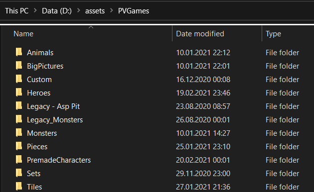

# RpgTools

RpgTools is a set of tools which allow to you create a 2D RPG or supports your existing game by providing tools you can use on top of it.

RpgTools.exe is the executable which contains all tools to create your content.

Game.exe is the executable you can use to test your game, this will also be used for the exported game(The game that will be deployed)

For discussions/questions about it the best way is to do that via [Discord Channel](https://discord.gg/GJEeeQv3Sp)

You can always download the latest version of the tools [here](https://nightmare-82.itch.io/rpg-tools)

If you want to support the development of my tools you can do that via [Patreon](https://www.patreon.com/user?u=32227148&fan_landing=true)

## FAQ

### Are there any tutorials ?
I frequently post updates in my Youtube channel : https://www.youtube.com/channel/UCPTY9yJt46Hn_6lmpg8ezhA which also contains a video tutorial playlist which you can find here : https://www.youtube.com/playlist?list=PLEJP6zEoNymUMp8cWQXbi5CPyr3ixTdRl

Besides that you can find more information in this guide.

### Where can I get help
The best places are my Discord channel : https://discord.gg/GJEeeQv3Sp or the PVGames software channel : https://discord.gg/KtnPFeK

### Where can I download old versions ?
If you use the itch.io launcher you can install old versions via Settings->Manager->Switch versions

### Known issues

#### Tool crashes after picking a directory
If the tool crashes after picking a directory there are two things you can try:
- use a short and simple path as the root folder, for example C:\assets\PVGames. Inside of it you can have sub folders per category as you wish. The problem is that the file paths currently can't exceed ~256 characters.
This is an example folder setup:

- don't use any non-ascii characters in your path : For example don't use letters like "池" and better use common characters to be sure.

- Avoid manual modifications of filenames from PVGames assets : The tool searches files using the PVGames naming conventions. If you rename files / add files to character directories it might confuse the alorithm which analyzes everything.

## Tools

There are several tools inside the RpgTools executable. The two main tools (Character Creator and Level Editor) can be used with any engine you want, the other tools are mostly meant to be used if you want to use this engine to create your game.

### Character Creator

With the Character Creator you can choose between all the units the tool has found in the folder(s) you added. You can view animations, configure custom equipment, configure custom colors and other things.
You can save/load the character configurations using json files so you can easily manage multiple characters.
Also you can export characters with various options to sprite sheets or export sprite frames.

### Level Editor
This is the tutorial for the [Level Editor](LevelEditor.md)

## Scripting
This is the tutorial for the [Scripting Language](Scripting.md)

## Libraries used

https://github.com/SFML/SFML

https://github.com/ocornut/imgui

https://github.com/texus/TGUI

https://github.com/eliasdaler/imgui-sfml

https://github.com/ThePhD/sol2

https://github.com/nlohmann/json

https://github.com/fmtlib/fmt

https://github.com/effekseer/Effekseer

https://bitbucket.org/wbenny/ziplib

https://github.com/erincatto/box2d

https://github.com/assimp/assimp
